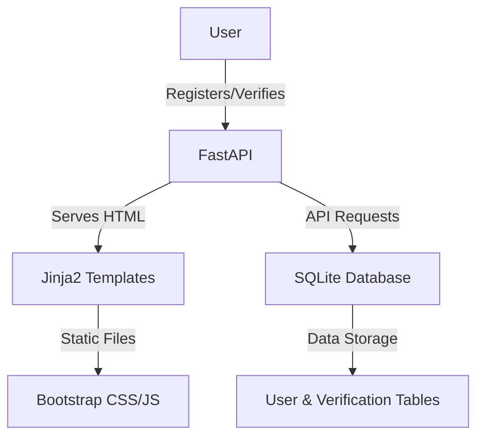

# Decentralized Identity Verification Platform

## Overview
The Decentralized Identity Verification Platform is a cutting-edge web application designed to provide secure and tamper-proof identity management through the use of blockchain technology. This platform addresses the increasing demand for decentralized identity verification processes, offering a reliable solution for both individuals and organizations. Users can register their identities, verify them, and manage their personal data through an intuitive interface. This platform is particularly beneficial for businesses and individuals looking to enhance security and privacy in identity management, ensuring that sensitive information is protected against unauthorized access and tampering.

## Features
- **User Registration**: Users can register their identity by providing their name and email address, which is stored securely in the database.
- **Identity Verification**: Users can verify their identity status using a unique user ID, ensuring that their identity is authenticated.
- **User Dashboard**: A centralized location where users can manage their identity information and view their verification status.
- **API Documentation**: Comprehensive documentation of API endpoints, enabling developers to integrate and utilize the platform's functionality.
- **Responsive Design**: The platform uses Bootstrap to ensure a responsive and user-friendly interface across various devices.
- **Database Management**: Utilizes SQLite for efficient storage and retrieval of user information and verification requests.
- **Dynamic Templating**: HTML pages are rendered dynamically using Jinja2 templates, enhancing user interaction and experience.

## Tech Stack
| Technology  | Description                         |
|-------------|-------------------------------------|
| Python      | Programming language                |
| FastAPI     | Web framework for building APIs     |
| Uvicorn     | ASGI server implementation          |
| Jinja2      | Templating engine                   |
| SQLite3     | Database management system          |
| Bootstrap   | Frontend framework for styling      |

## Architecture
The project architecture is designed to efficiently serve a frontend through FastAPI, which also manages API requests. The backend interacts with an SQLite database to handle user data and verification requests. The data flow is managed through API endpoints that facilitate CRUD operations on user data.



## Getting Started

### Prerequisites
- Python 3.11+
- pip (Python package installer)

### Installation
1. Clone the repository:
   ```bash
   git clone https://github.com/yourusername/decentralized-identity-verification-platform-auto.git
   cd decentralized-identity-verification-platform-auto
   ```
2. Install the required packages:
   ```bash
   pip install -r requirements.txt
   ```

### Running the Application
1. Start the FastAPI application using Uvicorn:
   ```bash
   uvicorn app:app --reload
   ```
2. Open your web browser and visit `http://127.0.0.1:8000` to access the platform.

## API Endpoints
| Method | Path                  | Description                            |
|--------|-----------------------|----------------------------------------|
| GET    | `/`                   | Home page                              |
| GET    | `/register`           | User registration page                 |
| GET    | `/verify`             | Identity verification page             |
| GET    | `/dashboard`          | User dashboard page                    |
| GET    | `/api-docs`           | API documentation page                 |
| POST   | `/api/register`       | Register a new user                    |
| GET    | `/api/verify/{user_id}` | Verify a user's identity status       |
| GET    | `/api/users`          | Retrieve a list of all users           |
| PUT    | `/api/users/{user_id}` | Update user information               |
| DELETE | `/api/users/{user_id}` | Delete a user                          |

## Project Structure
```
.
├── Dockerfile             # Docker configuration file
├── app.py                 # Main application file with FastAPI routes
├── requirements.txt       # Python dependencies
├── start.sh               # Shell script for starting the application
├── static
│   ├── css
│   │   └── bootstrap.min.css # Bootstrap CSS for styling
│   └── js
│       ├── register.js    # JavaScript for handling registration
│       └── verify.js      # JavaScript for handling verification
└── templates
    ├── api_docs.html      # HTML template for API documentation
    ├── dashboard.html     # HTML template for user dashboard
    ├── index.html         # HTML template for home page
    ├── register.html      # HTML template for registration page
    └── verify.html        # HTML template for verification page
```

## Screenshots
*Placeholder for screenshots of the application interface.*

## Docker Deployment
1. Build the Docker image:
   ```bash
   docker build -t decentralized-identity-verification .
   ```
2. Run the Docker container:
   ```bash
   docker run -d -p 8000:8000 decentralized-identity-verification
   ```

## Contributing
Contributions are welcome! Please fork the repository and submit a pull request for any improvements or bug fixes.

## License
This project is licensed under the MIT License.

---
Built with Python and FastAPI.
